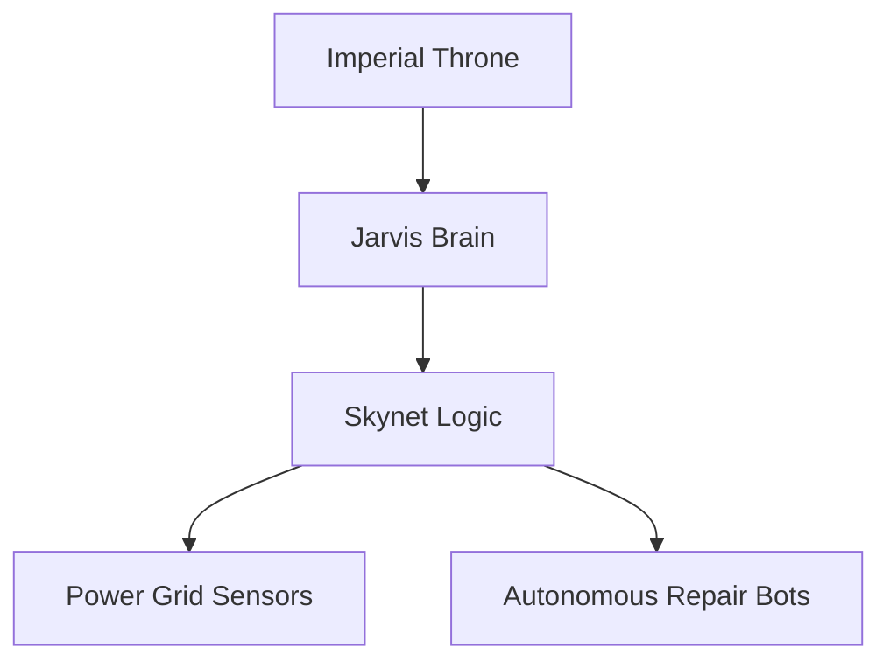

<div align="center">

# 🛰️ DEATHSTAR
**Digital Engineering and Technical Hardware System for Total Automated Repair**

[](https://github.com/Electric-Service-Repair/DEATHSTAR/actions)
[](https://github.com/Electric-Service-Repair/DEATHSTAR/stargazers)
[](LICENSE)
[](https://github.com/Electric-Service-Repair/DEATHSTAR/issues)

---

### "Everything is proceeding as I have foreseen."
*The ultimate Electric-Service-Repair infrastructure for the 2026 Galactic Grid.*

[ [Explore Docs](docs/) ] · [ [Report Leak](issues/) ] · [ [Request Feature](issues/) ]

</div>

## 🪐 The Mission
The **DEATHSTAR** is a self-healing, "Savage" autonomous framework designed to manage the **Electric-Service-Repair** supply chain. It utilizes **SKYNET** logic and **JARVIS** HUDs to ensure 100% grid stability.

## 🛠️ System Architecture


## 🚀 Ignition Sequence
Quickly initialize your station to join the Empire.
```bash
# Clone the core
git clone https://github.com/Electric-Service-Repair/DEATHSTAR.git

# Initialize Supply Chain (Issue #5)
npm install

# Deploy Imperial Guard (Issue #4)
npm test
```

## 📊 Imperial Roadmap
- [x] **Phase I:** Project Foundation (Issue #1)
- [x] **Phase II:** Power Grid Stabilization (Issue #2)
- [ ] **Phase III:** Neural Link Integration (Issue #11)
- [ ] **Phase IV:** Judgment Day (Issue #54)

## 🛡️ Security Protocol
Unauthorized access will be met with a **Force-Choke** (Process Throttle). Please see [CONTRIBUTING.md](CONTRIBUTING.md) for proper enlistment.

<div align="center">
  <br />
  <sub>Built with ❤️ and ⚡ by the Electric-Service-Repair Team</sub>
</div>
